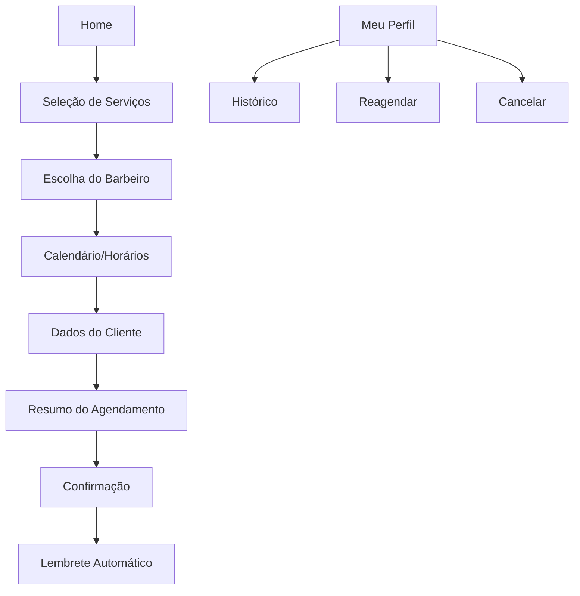
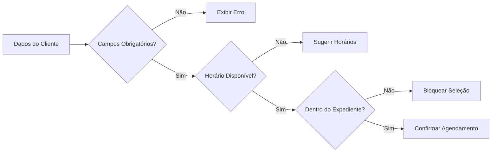
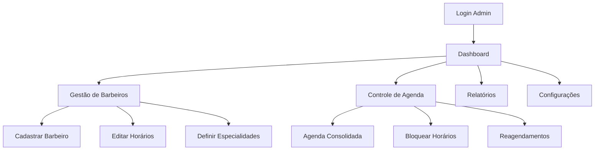
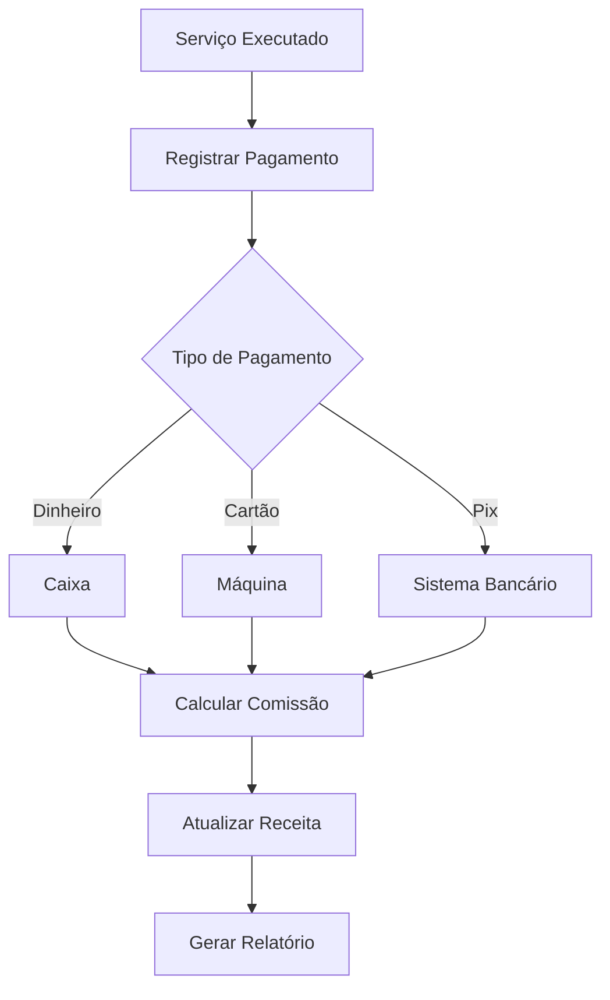
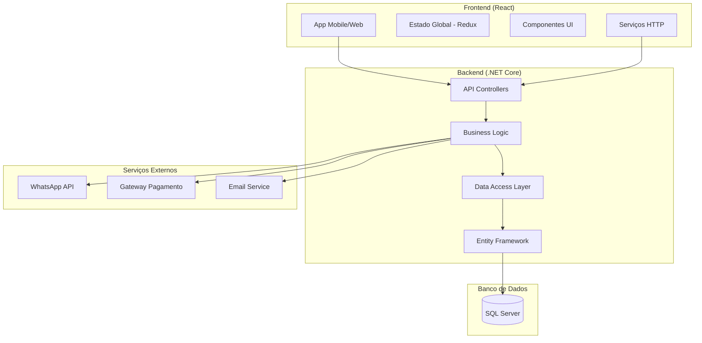
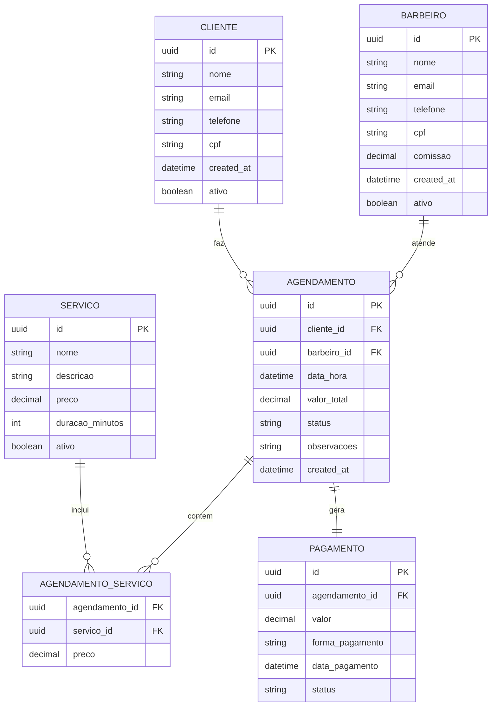
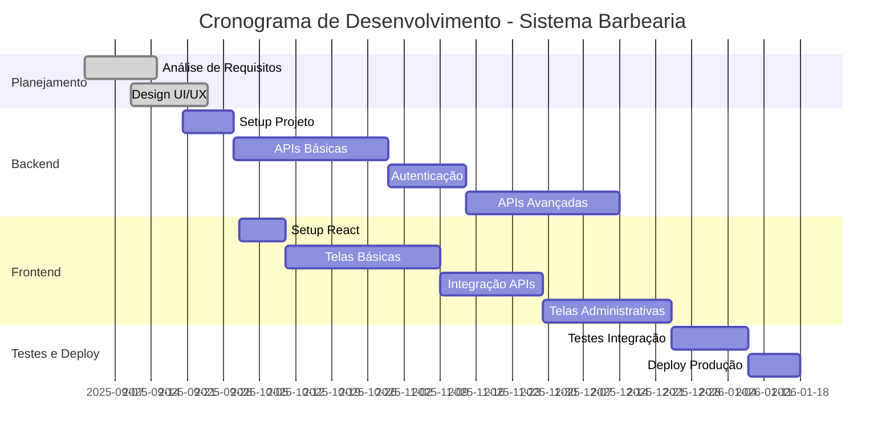

# PRD - Sistema de Agendamento de Barbearia

## Informações do Projeto

| Campo | Valor |
|-------|--------|
| **Projeto** | Sistema de Agendamento de Barbearia |
| **Versão** | 1.0 |
| **Status** | Em Planejamento |
| **Data de Criação** | 11 de Setembro de 2025 |
| **Responsável** | Equipe de Desenvolvimento |
| **Stack Tecnológica** | Frontend: React / Backend: .NET Core |
| **Prazo Estimado** | 4-6 meses |

---

## Sumário Executivo

Este documento descreve os requisitos para desenvolvimento de um sistema completo de agendamento de barbearia, contemplando front-end em **React** (mobile-first) e back-end em **.NET Core**. O sistema visa otimizar o processo de agendamento, reduzir cancelamentos através de lembretes automáticos, e facilitar a gestão financeira e operacional da barbearia.

### Objetivos Principais
- Digitalizar o processo de agendamento
- Reduzir conflitos de horários e cancelamentos
- Melhorar a experiência do cliente
- Facilitar a gestão administrativa e financeira
- Aumentar a eficiência operacional

---

## PRD 1: Módulo de Agendamento Online

### 1.1 Visão Geral
Sistema web responsivo que permite aos clientes agendar serviços de forma autônoma, com validação em tempo real de disponibilidade e envio automático de lembretes.

### 1.2 Personas
- **Cliente Final**: Pessoa que deseja agendar serviços de barbearia
- **Cliente Recorrente**: Cliente com histórico de agendamentos
- **Visitante**: Usuário não cadastrado que quer agendar

### 1.3 User Stories

#### US001 - Agendamento Básico
**Como** cliente  
**Quero** agendar um horário para corte de cabelo  
**Para que** eu possa ser atendido no dia e hora desejados

**Critérios de Aceitação:**
- Visualizar serviços disponíveis
- Selecionar barbeiro preferido
- Escolher data e horário disponível
- Confirmar agendamento
- Receber confirmação por email/WhatsApp

#### US002 - Cancelamento de Agendamento
**Como** cliente  
**Quero** cancelar meu agendamento  
**Para que** eu possa liberar o horário caso tenha imprevisto

**Critérios de Aceitação:**
- Cancelar até 2 horas antes do horário
- Receber confirmação de cancelamento
- Liberar horário para outros clientes

### 1.4 Fluxo de Telas (Mobile-First)



### 1.5 Wireframes

**Tela Home:**
- Logo da barbearia
- Menu de navegação
- Cards dos serviços principais
- Botão "Agendar Agora" (CTA principal)
- Depoimentos/avaliações

**Tela de Seleção de Barbeiro:**
- Grid de barbeiros com foto
- Nome, especialidade e avaliação
- Indicador de disponibilidade
- Filtro por especialidade

**Tela de Agendamento:**
- Calendário interativo
- Lista de horários disponíveis
- Resumo do serviço selecionado
- Campo para observações

### 1.6 Validações



**Regras de Validação:**
- Nome: obrigatório, mínimo 2 caracteres
- Telefone: formato (xx) xxxxx-xxxx
- Email: formato válido
- Data: não pode ser anterior ao dia atual
- Horário: deve estar dentro do expediente do barbeiro
- Serviço: deve estar ativo no sistema

### 1.7 APIs REST

```json
// POST /api/appointments
{
  "clienteId": "uuid",
  "barbeiroId": "uuid",
  "servicoIds": ["uuid1", "uuid2"],
  "dataHora": "2025-09-12T10:30:00",
  "observacoes": "string",
  "tipoAgendamento": "presencial|online"
}

// Response 201 Created
{
  "id": "uuid",
  "numero": "A001234",
  "status": "confirmado",
  "valorTotal": 35.00,
  "tempoEstimado": 45,
  "lembreteEnviado": true
}
```

```json
// GET /api/barbers/{id}/availability?date=2025-09-12
{
  "barbeiro": {
    "id": "uuid",
    "nome": "João Silva",
    "especialidades": ["corte", "barba"]
  },
  "horariosDisponiveis": [
    "09:00", "09:30", "10:00", "11:00"
  ],
  "horariosOcupados": [
    "10:30", "14:00", "15:30"
  ]
}
```

---

## PRD 2: Módulo de Gestão Administrativa

### 2.1 Visão Geral
Painel administrativo para gestão de barbeiros, horários, serviços e controle de agenda consolidada.

### 2.2 Personas
- **Administrador**: Dono da barbearia
- **Gerente**: Responsável pela gestão operacional
- **Barbeiro**: Profissional que executa os serviços

### 2.3 User Stories

#### US003 - Dashboard Administrativo
**Como** administrador  
**Quero** visualizar resumo das operações do dia  
**Para que** eu possa acompanhar o desempenho da barbearia

#### US004 - Gestão de Barbeiros
**Como** administrador  
**Quero** cadastrar e gerenciar barbeiros  
**Para que** eu possa controlar a equipe e horários

### 2.4 Fluxo Administrativo



### 2.5 Telas do Painel Administrativo

**Dashboard:**
- Cards com métricas (agendamentos do dia, receita, cancelamentos)
- Gráfico de agendamentos por período
- Lista de agendamentos próximos
- Alertas importantes

**Gestão de Barbeiros:**
- Lista de barbeiros ativos/inativos
- Formulário de cadastro/edição
- Definição de horários de trabalho
- Configuração de especialidades e preços

### 2.6 APIs Administrativas

```json
// POST /api/admin/barbers
{
  "nome": "João Silva",
  "cpf": "000.000.000-00",
  "telefone": "(11) 99999-9999",
  "email": "joao@barbearia.com",
  "especialidades": ["corte", "barba", "sobrancelha"],
  "horarioTrabalho": {
    "segunda": {"inicio": "08:00", "fim": "18:00"},
    "terca": {"inicio": "08:00", "fim": "18:00"},
    "quarta": null,
    "quinta": {"inicio": "08:00", "fim": "18:00"},
    "sexta": {"inicio": "08:00", "fim": "18:00"},
    "sabado": {"inicio": "08:00", "fim": "16:00"},
    "domingo": null
  },
  "comissao": 50.0,
  "ativo": true
}
```

```json
// GET /api/admin/dashboard
{
  "agendamentosHoje": 15,
  "receitaHoje": 525.00,
  "cancelamentosHoje": 2,
  "ocupacao": 85.5,
  "proximosAgendamentos": [
    {
      "id": "uuid",
      "cliente": "Maria Silva",
      "barbeiro": "João",
      "servico": "Corte Feminino",
      "horario": "2025-09-12T14:30:00",
      "status": "confirmado"
    }
  ]
}
```

---

## PRD 3: Módulo Financeiro e Relatórios

### 3.1 Visão Geral
Sistema de controle financeiro integrado com gestão de pagamentos, comissões e relatórios gerenciais.

### 3.2 User Stories

#### US005 - Controle Financeiro
**Como** administrador  
**Quero** controlar receitas e despesas  
**Para que** eu possa acompanhar a saúde financeira da barbearia

#### US006 - Cálculo de Comissões
**Como** administrador  
**Quero** calcular automaticamente as comissões dos barbeiros  
**Para que** eu possa fazer os pagamentos corretamente

### 3.3 Fluxo Financeiro



### 3.4 APIs Financeiras

```json
// POST /api/financial/payments
{
  "agendamentoId": "uuid",
  "valor": 35.00,
  "formaPagamento": "cartao|dinheiro|pix",
  "desconto": 0.00,
  "observacoes": "string"
}

// GET /api/financial/reports/daily?date=2025-09-12
{
  "data": "2025-09-12",
  "totalReceita": 820.00,
  "totalComissoes": 410.00,
  "servicosRealizados": 23,
  "formaPagamento": {
    "dinheiro": 120.00,
    "cartao": 550.00,
    "pix": 150.00
  },
  "porBarbeiro": [
    {
      "barbeiro": "João Silva",
      "servicos": 8,
      "receita": 280.00,
      "comissao": 140.00
    }
  ]
}
```

---

## Especificações Técnicas

### 4.1 Arquitetura do Sistema



### 4.2 Stack Tecnológica

**Frontend:**
- React 18+
- Material-UI ou Chakra UI
- React Router
- React Query para cache
- React Hook Form + Yup
- Axios para HTTP
- PWA (Progressive Web App)

**Backend:**
- .NET 8 / ASP.NET Core
- Entity Framework Core
- SQL Server
- JWT Authentication
- SignalR (notificações em tempo real)
- Swagger/OpenAPI

**DevOps:**
- Docker containers
- Azure/AWS hosting
- CI/CD com Azure DevOps
- Monitoring com Application Insights

### 4.3 Modelo de Dados



### 4.4 Segurança e Permissões

| Perfil | Permissões |
|--------|------------|
| **Cliente** | Ver próprios agendamentos, Agendar, Cancelar, Reagendar |
| **Barbeiro** | Ver agenda própria, Confirmar atendimentos, Ver clientes do dia |
| **Gerente** | Todas do Barbeiro + Relatórios, Gestão de barbeiros |
| **Admin** | Acesso total ao sistema |

**Implementação de Segurança:**
- JWT com refresh tokens
- Rate limiting nas APIs
- Validação de entrada (sanitização)
- HTTPS obrigatório
- Auditoria de operações críticas

---

## Bibliotecas e Componentes React Recomendados

### 5.1 UI e Design System
```javascript
// Instalação de dependências
npm install @mui/material @emotion/react @emotion/styled
npm install react-datepicker date-fns
npm install react-hook-form @hookform/resolvers yup
npm install react-query axios
```

### 5.2 Componente de Agendamento (Exemplo)
```javascript
import { DatePicker } from 'react-datepicker';
import { useForm } from 'react-hook-form';
import { yupResolver } from '@hookform/resolvers/yup';

const AgendamentoForm = () => {
  const { register, handleSubmit, formState: { errors } } = useForm({
    resolver: yupResolver(agendamentoSchema)
  });

  return (
    <Box component="form" onSubmit={handleSubmit(onSubmit)}>
      <Grid container spacing={2}>
        <Grid item xs={12}>
          <FormControl fullWidth>
            <InputLabel>Serviço</InputLabel>
            <Select {...register('servicoId')}>
              {servicos.map(servico => (
                <MenuItem key={servico.id} value={servico.id}>
                  {servico.nome} - R$ {servico.preco}
                </MenuItem>
              ))}
            </Select>
          </FormControl>
        </Grid>
        
        <Grid item xs={12}>
          <DatePicker
            selected={selectedDate}
            onChange={setSelectedDate}
            filterDate={isDateAvailable}
            minDate={new Date()}
            dateFormat="dd/MM/yyyy"
          />
        </Grid>
      </Grid>
    </Box>
  );
};
```

---

## Cronograma de Desenvolvimento



---

## Considerações Finais

### 6.1 Riscos e Mitigações
- **Risco**: Complexidade da sincronização em tempo real
  - **Mitigação**: Usar SignalR para WebSockets
- **Risco**: Performance com muitos agendamentos
  - **Mitigação**: Implementar paginação e cache
- **Risco**: Integração com serviços externos
  - **Mitigação**: Implementar circuit breaker pattern

### 6.2 Métricas de Sucesso
- Redução de 80% no tempo de agendamento
- Diminuição de 50% nos cancelamentos
- Aumento de 30% na taxa de ocupação
- 95% de uptime do sistema
- Tempo de resposta < 2 segundos

### 6.3 Roadmap Futuro
- **Fase 2**: App mobile nativo
- **Fase 3**: Sistema de fidelidade
- **Fase 4**: Integração com redes sociais
- **Fase 5**: IA para sugestão de horários

---

## Anexos

### A. Glossário
- **CTA**: Call to Action
- **PWA**: Progressive Web App  
- **JWT**: JSON Web Token
- **API**: Application Programming Interface
- **UI/UX**: User Interface/User Experience

### B. Referências
- Material Design Guidelines
- React Best Practices
- .NET Core Documentation
- REST API Design Standards

---

*Documento criado em 11/09/2025 - Versão 1.0*